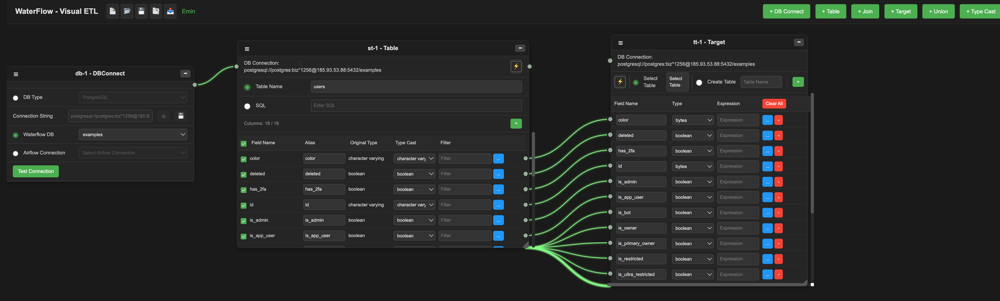

<h1 align="center">ElementsData</h1>

  <em>Cloud-native modular data platform extending Apache Airflow & Apache Superset</em>

  
  
  
  
  
  
  
  

  

  

---

## What is ElementsData?

ElementsData is a cloud-native modular data platform designed and built from the ground up — covering the full data engineering lifecycle across ETL, AI-assisted transformations, data quality, real-time streaming, metadata management, and BI visualisation.

Modules run standalone on cloud infrastructure or integrate seamlessly with Apache Airflow for full orchestration. Built for data engineers who need a unified, production-grade platform without vendor lock-in.

---

## Modules

| Module | Role |
|--------|------|
| WaterFlow | ETL / pipeline designer for batch & cloud pipelines |
| FireFlow | AI-powered code generation — dbt, Spark, Python & Qlik transformations |
| GuardFlow | Data quality validation and monitoring |
| EarthFlow | Metadata management, CDC tracking and storage integration |
| BiFlow | Dashboards & BI visualisation for insights |
| FTLFlow | Real-time streaming and low-latency pipelines |

---

## FireFlow — AI Engine

Custom-trained on **NVIDIA Jetson Orin** hardware. Generates data engineering code **offline** — fully operational in air-gapped and edge environments.

---

## Deployment

Modules run standalone or fully orchestrated under Airflow. Deployable on cloud or edge infrastructure via Docker & Terraform.

---

## Stack

`Python` · `Apache Airflow` · `Apache Superset` · `dbt` · `PySpark` · `Delta Lake` · `Kafka` · `FastAPI` · `Docker` · `Terraform` · `NVIDIA Jetson Orin`
